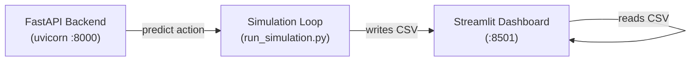

m# ⚡ Energy Trading Agent — Live Demo Guide

This guide walks you through running the **Streamlit live dashboard** that visualises a reinforcement-learning PPO agent trading in a simulated energy market.

---

## Prerequisites

| Requirement | Version | Check |
|---|---|---|
| Python | 3.12+ | `python --version` |
| uv | latest | `uv --version` |
| CUDA _(optional)_ | 13.0+ | `nvidia-smi` |

Install all project dependencies once:

```bash
uv sync
```

---

## Architecture Overview

The demo runs **three processes** concurrently:



| Component | What it does | Port |
|---|---|---|
| **FastAPI Backend** | Serves the trained PPO model via `/api/v1/trade` | `8000` |
| **Simulation Loop** | Generates hourly market ticks (price + demand), calls the API, logs to CSV | — |
| **Streamlit Dashboard** | Reads the CSV log every 2 s and renders live KPI cards + Plotly charts | `8501` |

---

## Quick Start (One Command)

```bash
bash scripts/start_demo.sh
```

This automatically:
1. Trains the PPO agent if `models/ppo_energy_agent.zip` does not exist
2. Starts the FastAPI backend on `http://127.0.0.1:8000`
3. Starts the simulation loop (7 days, 1× speed by default)
4. Starts the Streamlit dashboard on `http://localhost:8501`

### Speed control

```bash
# Fast mode — 1 real second = 60 simulated hours
bash scripts/start_demo.sh --speed 60

# Default — 1 real second = 1 simulated hour
bash scripts/start_demo.sh
```

Press **Ctrl-C** to stop all processes.

---

## Step-by-Step Manual Launch

If you prefer to run each component in its own terminal:

### 1. Train the agent (skip if model exists)

```bash
PYTHONPATH=. uv run scripts/train_demo_agent.py --timesteps 200000
```

This creates `models/ppo_energy_agent.zip` (~140 KB). Training takes 1–2 min on CPU.

### 2. Start the API server

```bash
PYTHONPATH=. uv run uvicorn src.main:app --host 127.0.0.1 --port 8000
```

Verify: `curl http://127.0.0.1:8000/health` → `{"status":"healthy"}`

### 3. Start the simulation

```bash
PYTHONPATH=. uv run scripts/run_simulation.py --speed 1 --hours 168
```

Logs appear in `data/demo_logs/simulation_log.csv`.

### 4. Start the Streamlit dashboard

```bash
PYTHONPATH=. uv run streamlit run src/demo/dashboard.py --server.headless true --server.port 8501
```

Open **http://localhost:8501** in your browser.

---

## Dashboard Features

### KPI Cards (top row)

| Card | Description |
|---|---|
| **Account Balance** | Current cash balance ($) |
| **Battery Level** | Energy stored (kWh), max 50 kWh |
| **Cumulative P&L** | Running profit/loss since start |
| **Buys / Sells** | Trade action counts |
| **Unmet Demand** | Total demand the battery could not cover |

### Charts

| Chart | Description |
|---|---|
| **Market Price & Demand** | Dual-axis time series with BUY/SELL/HOLD action markers |
| **Battery & Balance** | Battery charge level vs account balance over time |
| **Cumulative Profit & Loss** | Area chart showing P&L trajectory |

### Recent Actions Table

The bottom table shows the last 20 actions with price, demand, and reward.

---

## Configuration Reference

| Parameter | Default | Where to change |
|---|---|---|
| Simulation speed | `1` (1 s = 1 hour) | `--speed` flag on `start_demo.sh` or `run_simulation.py` |
| Simulation length | `168` hours (7 days) | `--hours` flag on `run_simulation.py` |
| Training timesteps | `200000` | `--timesteps` flag on `train_demo_agent.py` |
| API port | `8000` | `start_demo.sh` or uvicorn command |
| Dashboard port | `8501` | `--server.port` flag on streamlit |
| Dashboard refresh | `2` seconds | `REFRESH_INTERVAL` in `src/demo/dashboard.py` |
| Battery capacity | `50.0 kWh` | `src/config.py` → `MAX_BATTERY_CAPACITY_KWH` |
| Initial balance | `$10,000` | `scripts/run_simulation.py` (line 23) |
| Model save path | `models/ppo_energy_agent.zip` | `src/config.py` → `MODEL_SAVE_PATH` |

---

## Key Source Files

| File | Role |
|---|---|
| `scripts/start_demo.sh` | One-command launcher for the full demo |
| `scripts/train_demo_agent.py` | Trains the PPO agent and saves the model |
| `scripts/run_simulation.py` | Runs the hourly market simulation loop |
| `src/demo/dashboard.py` | Streamlit dashboard (auto-refreshing) |
| `src/demo/data_provider.py` | Generates market ticks (price + demand) |
| `src/envs/energy_trading_env.py` | Gymnasium env for the PPO agent |
| `src/agent/ppo_model.py` | Model loading + inference |
| `src/api/routes.py` | FastAPI `/trade` endpoint |
| `src/api/schemas.py` | Pydantic request/response models |
| `src/config.py` | Global constants (battery, balance, model path) |

---

## Troubleshooting

### Port already in use

```
ERROR: [Errno 98] Address already in use
```

Kill the occupying process:
```bash
# Find and kill whatever is on port 8000 / 8501
lsof -ti:8000 | xargs kill -9
lsof -ti:8501 | xargs kill -9
```

### Model not found (API returns action `2` / HOLD for everything)

Train the agent:
```bash
PYTHONPATH=. uv run scripts/train_demo_agent.py --timesteps 200000
```

### Streamlit shows "Waiting for simulation data…"

The simulation loop has not started or has not yet written the first log entry. Make sure `run_simulation.py` is running and `data/demo_logs/simulation_log.csv` exists.

### CUDA / GPU errors

The demo runs fine on CPU. Force CPU-only mode:
```bash
CUDA_VISIBLE_DEVICES= bash scripts/start_demo.sh
```

### Import errors

Ensure `PYTHONPATH` includes the project root:
```bash
export PYTHONPATH=/path/to/Energy-Load-Forecasting
```

Or use `uv run` which handles this automatically.
